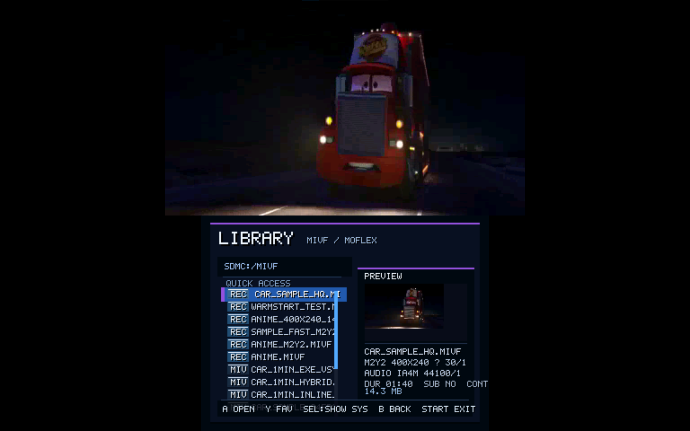
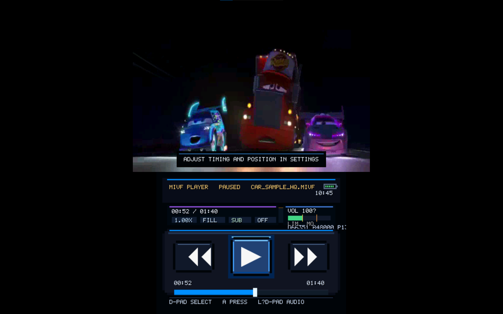
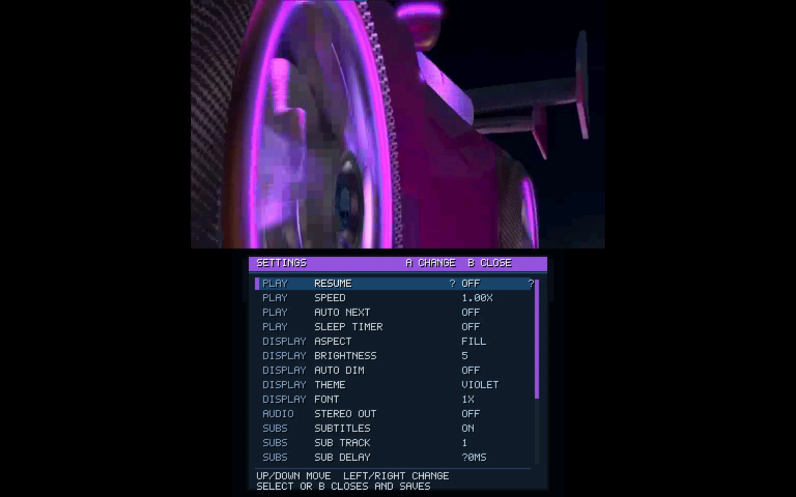
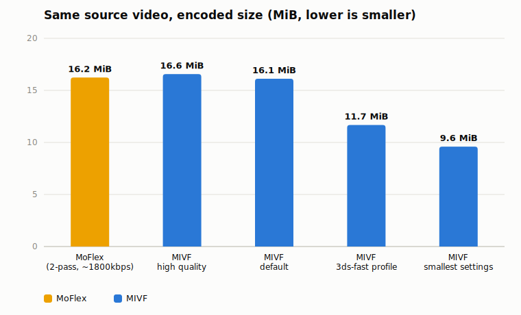
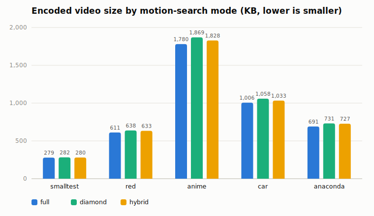
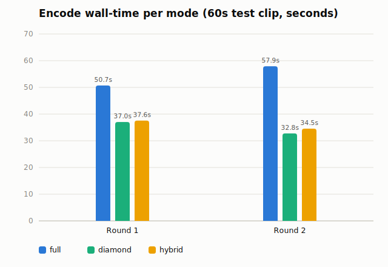

# MIVF Player for Nintendo 3DS

A homebrew video player for the Nintendo 3DS. MIVF uses a custom page-based video container, software codecs tuned for the ARM11, a native C player, and a PC-side encoder that converts ordinary video files into `.mivf`.


**Status:** Tested on real hardware (New 3DS / Old 3DS) and the Azahar emulator. Primary target: 400×240, 30 fps. Old 3DS may need the `--profile 3ds-fast` encoder preset for smooth playback.

## Index

- [Screenshots](#screenshots)
- [Features](#features)
- [Controls](#controls)
- [Installation](#installation)
- [Encoding Videos](#encoding-videos)
- [Benchmarks](#benchmarks)
- [Sidecar Files](#sidecar-files)
- [Performance Notes](#performance-notes)
- [Documentation Index](#documentation-index)
- [Developer Build](#developer-build)
- [Patch Notes](#patch-notes)
- [Acknowledgements](#acknowledgements)
- [License and Attribution](#license-and-attribution)

## Screenshots

Captured via the Azahar emulator. ⚠️ Azahar's display scaling doesn't represent real hardware quality — on an actual 3DS's small physical screen, the same encode looks noticeably sharper and higher-quality than these captures suggest.

**File browser** \


**Playback with subtitles** \


**Settings menu** \


## Features

Custom codecs (M2Y1 / M2Y2, entropy-coded) ✅ \
MoFlex (`.moflex`, MobiClip 3D video) playback ✅ \
File browser with thumbnails, favorites, recents ✅ \
Auto-resume bookmarks ✅ \
Auto-advance to next file in folder ✅ \
Aspect ratio modes (FIT / STRETCH / NATIVE) ✅ \
A/B scene looper ✅ \
Playback speed 0.5×–2.0× ✅ \
Sleep timer + lid-close pause ✅ \
Subtitles (`.srt`, multi-track, delay, position) ✅ \
Chapters with named markers ✅ \
Themes, brightness, auto-dim, font scale ✅ \
Touch transport (drag to scrub) ✅ \
Seek index (sidecar + embedded, fast open) ✅ \
In-app controls help screen ✅

See [docs/CONTROLS.md](docs/CONTROLS.md) for how to use each feature, or [docs/ARCHITECTURE.md](docs/ARCHITECTURE.md) for how the codec/pipeline works under the hood.

## Controls

See [docs/CONTROLS.md](docs/CONTROLS.md) for the full control map — or open the **in-app help screen** (press X in the browser, or Settings → CONTROLS during playback) for a live, always-current reference.

### Quick Reference

| Context | Button | Action |
| :--- | :--- | :--- |
| Browser | D-Pad ↑/↓ | Move selection |
| Browser | A | Open file |
| Browser | Y | Toggle favorite |
| Browser | X | Open controls help screen |
| Browser | B / START | Exit |
| Playback | A | Play / pause |
| Playback | ←/→ | Seek ±5 s |
| Playback | Touch + drag | Scrub timeline |
| Playback | X | Cycle playback speed |
| Playback | B | A/B loop marker |
| Playback | Y | Cycle subtitle track |
| Playback | L + D-Pad | Audio volume |
| Playback | R + ↑/↓ | Screen brightness |
| Playback | R + ←/→ | Previous / next chapter |
| Playback | SELECT | Open settings |
| Playback | START | Stop and return to browser |
| Settings | CONTROLS row → A | Open controls help screen |
| Controls help | D-Pad ↑/↓ | Scroll |
| Controls help | B / START / X | Close |

### Settings (SELECT)
D-Pad ↑/↓ to move, A/←/→ to change, B or SELECT to close and save.

## Installation

See [docs/INSTALLING.md](docs/INSTALLING.md) for detailed instructions.

1. Download `mivf_player_3ds.cia` (HOME menu) or `mivf_player_3ds.3dsx` (Homebrew Launcher) from the [Releases page](../../releases).
2. Install `.cia` with FBI, or place `.3dsx` in `sdmc:/3ds/`.
3. Put `.mivf` files in `sdmc:/mivf/`. The player also scans `sdmc:/3ds/mivf_player_3ds/` and the SD root.
4. Settings and app data live under `sdmc:/3ds/mivf_player_3ds/appdata/`. Legacy root-level settings are still read for migration.

## Encoding Videos

See [docs/ENCODING.md](docs/ENCODING.md) for full encoder documentation and tuning guidance.

Quick examples:

```bash
# Recommended: M2Y2 (smaller files, same quality)
python encode_mivf.py input.mp4 output.mivf --m2y2

# Old 3DS: smaller packets for smoother playback
python encode_mivf.py input.mp4 output.mivf --m2y2 --profile 3ds-fast

# Batch encode a folder
python encode_mivf.py ./videos/ ./output/
```

**Requirements:** Python 3 and `ffmpeg` on your system PATH.

### Encoder EXE Builds

Release packages may also include a prebuilt Windows encoder:

```bash
encode_mivf.exe input.mp4 output.mivf --m2y2
encode_mivf.exe input.mp4 output.mivf --m2y2 --motion-search hybrid
encode_mivf.exe input.mp4 output.mivf --m2y2 --profile 3ds-fast
### Key Encoder Flags

| Flag | Purpose |
| :--- | :--- |
| `--m2y2` | Use M2Y2 codec (smaller files, ~20% savings) |
| `--profile 3ds-fast` | Tune for Old 3DS playback smoothness |
| `--report-packet-sizes` | Print per-video-packet size histogram after encoding |
| `--motion-search {full,diamond,fast,hybrid}` | Motion search algorithm (default `full`). See [Benchmarks](#benchmarks) below |
| `--warm-start-chunks` | Avoid a hard keyframe reset at parallel-chunk boundaries |
| `--max-video-packet-kb` | Retry a chunk at higher QP if any packet exceeds this size |
| `--no-seek-index` | Skip `.idx` sidecar generation |
| `--no-embedded-index` | Skip embedded seek footer in `.mivf` |
| `--qp` | Quality parameter (higher QP = smaller file, lower quality) |
| `--keep {4,8,16}` | Transform coefficients per quadrant (16 = max detail, 4 = smallest) |
| `--fps` | Override output frame rate |
| `--jobs` | Parallel encoder workers (default 8) |
| `--audio-codec {ia4m,pc16}` | Audio format: ia4m (ADPCM mono, small) or pc16 (PCM stereo, larger) |

See `python encode_mivf.py --help` for the complete flag list, or [docs/cli-reference.md](docs/cli-reference.md).

### Recommended Encoder Settings

| Target | Recommended flags |
| :--- | :--- |
| New 3DS, best quality | `--m2y2` (defaults are already quality-favoring: `--qp 34 --keep 16`) |
| Old 3DS, smooth playback | `--m2y2 --profile 3ds-fast` |
| Old 3DS, still choppy | add `--keep 8` or `--keep 4`, or lower `--fps 24` |
| Smallest file size | `--m2y2 --profile 3ds-fast --qp 45 --lambda 45 --keep 4 --c-qp-offset 10` |

See [docs/PERFORMANCE_TUNING.md](docs/PERFORMANCE_TUNING.md) for the full step-by-step tuning ladder.

## Benchmarks

⚠️ Encode time, output size, and quality all depend on source content, resolution, and encoder settings — these are real measurements from one test pass, not a guarantee for every video.

### File Size: MIVF vs MoFlex

File size efficiency versus the 3DS's built-in MoFlex (MobiClip) format was the original motivation for this project. Here's an honest test: one 62-second source clip (`anime.mp4`, 400×240, 30 fps), encoded once with a real 2-pass MobiClip encode, and four times through `encode_mivf.py` at different quality settings. MIVF only ever implemented a MoFlex *decoder* (for playback compatibility) — never an encoder — so the MoFlex file here was produced with separate external tooling, not anything in this repo.

<picture>
  <source media="(prefers-color-scheme: dark)" srcset="docs/assets/benchmarks/chart_moflex_dark.svg">
  
</picture>

| Encode | Total file size | vs MoFlex | Video stream only | vs MoFlex video | PSNR (combined) | Encode time* |
| :--- | ---: | ---: | ---: | ---: | ---: | ---: |
| MoFlex (2-pass, ~1800 kbps) | 16.24 MiB | — | 13.08 MiB | — | not measured** | ~154 s |
| MIVF `--qp 24` (high quality) | 16.57 MiB | +2.0% | 15.11 MiB | +15.5% | 37.67 dB | 23–61 s |
| MIVF default | 16.12 MiB | −0.7% | 14.66 MiB | +12.1% | 37.87 dB | 23–61 s |
| MIVF `--profile 3ds-fast` | 11.68 MiB | −28.1% | 10.22 MiB | −21.9% | 35.26 dB | 23–61 s |
| MIVF smallest settings*** | 9.60 MiB | −40.9% | 8.14 MiB | −37.8% | 33.59 dB | 23–61 s |

\* Wall-clock, single dev machine, `--jobs 8`; varied 23–61 s run-to-run for every MIVF tier depending on system load, so treat it as "same rough order of magnitude," not a controlled benchmark. MoFlex's ~154 s used a separate 2-pass external tool on the same machine, so it isn't a fair apples-to-apples speed comparison either — included only for scale. \
\*\* MIVF has no MoFlex encoder, only a decoder, so there's no in-repo way to compute reference PSNR for the MoFlex file — only its size is compared here. \
\*\*\* `--m2y2 --profile 3ds-fast --qp 45 --lambda 45 --keep 4 --c-qp-offset 10`

**Takeaway:** total file size is close between the formats — MIVF's default settings land within a percent of MoFlex, and the high-quality preset is actually a couple percent *larger*. That's despite MIVF's audio track being smaller here (mono 44.1kHz ADPCM vs. the MoFlex sample's stereo 48kHz ADPCM — a constant ~1.4 MiB difference that has nothing to do with video compression). Looking at video-only bytes with audio factored out, MobiClip's codec is actually more bit-efficient than MIVF at comparable quality on this clip. MIVF only pulls meaningfully ahead once you're willing to spend quality to get there: `--profile 3ds-fast` trades about 2.4 dB of PSNR for ~28% smaller files, and the smallest-settings preset trades ~4 dB for ~41% smaller. So the honest framing isn't "MIVF beats MoFlex at the same quality" — it's that MIVF is a fully open format this project can both encode and decode, with the quality/size tradeoff fully exposed and tunable, and its low-size tiers get substantially smaller than MoFlex when a smaller file matters more than matching MoFlex's quality.

### Motion Search Mode Comparison

5 short test clips (a mix of simple/synthetic and real-world video, varying resolution and motion complexity; clip names aren't shown since they're arbitrary local test files, not something a reader could look up anyway). `full` is the default, exhaustive search; `diamond` and `hybrid` are experimental faster modes — see [docs/PERFORMANCE_TUNING.md](docs/PERFORMANCE_TUNING.md#motion-search-modes).

<picture>
  <source media="(prefers-color-scheme: dark)" srcset="docs/assets/benchmarks/chart_size_dark.svg">
  
</picture>

<picture>
  <source media="(prefers-color-scheme: dark)" srcset="docs/assets/benchmarks/chart_speed_dark.svg">
  
</picture>

**Quality (PSNR, dB — higher is better; combined Y/Cb/Cr, frame-weighted):**

| Clip | full | diamond | hybrid |
| :--- | ---: | ---: | ---: |
| Clip 1 | 51.21 | 51.15 | 51.17 |
| Clip 2 | 38.24 | 38.14 | 38.12 |
| Clip 3 | 38.35 | 38.26 | 38.29 |
| Clip 4 | 36.95 | 36.77 | 36.81 |
| Clip 5 | 37.04 | 37.00 | 36.99 |

**Takeaway:** `diamond` encodes noticeably faster than `full` at the cost of a few percent larger files and a small PSNR loss. `hybrid` tracks `diamond`'s speed closely while generally landing closer to `full`'s file size — the improvement over `diamond` was clip-dependent, not uniform. `full` remains the safest choice when size/quality matters more than encode time; use `--report-packet-sizes` and compare the `ENCODE SUMMARY` output before committing to an experimental mode for a release.

## Sidecar Files

Place these next to `yourvideo.mivf`:

| File | Purpose |
| :--- | :--- |
| `yourvideo.srt`, `yourvideo.1.srt` | Subtitle tracks (cycle with Y) |
| `yourvideo.chapters` | Chapter markers with optional labels |
| `yourvideo.cover` | Poster image (raw RGB565, browser-preview size) |
| `yourvideo.nfo` | Synopsis text shown in the browser preview |
| `yourvideo.idx` | Seek index sidecar (auto-generated by encoder) |

See [docs/FILES_AND_SIDECARS.md](docs/FILES_AND_SIDECARS.md) for details.

## Performance Notes

- **New 3DS:** M2Y2 at 400×240, 30 fps runs well with default encoder settings.
- **Old 3DS:** Use `--profile 3ds-fast` when encoding. Consider `--keep 4` or `--keep 8` for demanding content. See [docs/PERFORMANCE_TUNING.md](docs/PERFORMANCE_TUNING.md).
- **Seek index:** Encoder generates both sidecar (`.idx`) and embedded index by default. Large uncached files skip expensive synchronous scanning at open time for faster load.

## Documentation Index

- [Installing](docs/INSTALLING.md)
- [Encoding Videos](docs/ENCODING.md)
- [CLI Reference](docs/cli-reference.md)
- [Controls Reference](docs/CONTROLS.md)
- [Files & Sidecars](docs/FILES_AND_SIDECARS.md)
- [Seek Index](docs/SEEK_INDEX.md)
- [MoFlex Status](docs/MOFLEX_STATUS.md)
- [Performance Tuning](docs/PERFORMANCE_TUNING.md)
- [Developer Build](docs/DEVELOPING.md)
- [Troubleshooting](docs/TROUBLESHOOTING.md)
- [Architecture](docs/ARCHITECTURE.md)
- [Release Checklist](docs/RELEASE_CHECKLIST.md)
- [Changelog](docs/changelog.md)

## Developer Build

See [docs/DEVELOPING.md](docs/DEVELOPING.md) for full instructions.

Quickstart:

```bash
# Requires devkitPro (3ds-dev group: devkitARM + libctru)
make          # builds mivf_player_3ds.3dsx
make cia      # builds mivf_player_3ds.cia (requires makerom + bannertool)
```

### Repository Layout

- **`source/`** — Native 3DS player (C). `main.c` is the app; `mivf_*.c/.h` are modules.
- **`tools/`** — Native encoder, M2Y2 transcoder, and helper binaries.
- **`meta/`** — Icon, banner, banner audio, makerom RSF.
- **`Makefile`** — Builds `.3dsx` and `make cia` for installable title.
- **`encode_mivf.py`** — Python front-end for ffmpeg → `.mivf` encoding.

## Patch Notes

Full history: [docs/changelog.md](docs/changelog.md) and the [GitHub Releases page](../../releases).

### v2026.07.07 — Encoder Speed and UI Polish

**Changes**
- Added encoder packet-spike diagnostics and worst-packet reporting.
- Added `--warm-start-chunks` to reduce repeated chunk-boundary keyframes.
- Added experimental `--motion-search {full,diamond,fast}` encoder modes.
- Improved browser responsiveness by deferring file-size `stat()` calls until preview load.

**Fixed bugs**
- Playback inactivity dimming now only dims the bottom-screen UI; the top video stays visible.
- Confirmed HOME/lid/suspend behavior stays separated from normal playback autodim.

### v2026.07.05

**Changes**
- Updated README and full documentation set.
- Added sidecar and embedded seek-index support.
- Added encoder packet-size report.
- Added `--profile 3ds-fast` for smaller, Old-3DS-friendly encodes.
- Improved large-file startup behavior and browser preview responsiveness on Old 3DS.
- Improved settings responsiveness by saving on close instead of on every value change.
- UI polish for browser, settings, alerts, timeline, and playback footer.

### v1.0.0 — Initial Release

First official release. Includes PC encoders and 3DS binaries.

## Acknowledgements

Built with devkitPro / devkitARM and libctru. CIA packaging uses makerom and bannertool. MoFlex demuxer and decoder are adapted from FFmpeg (LGPL).

## License and Attribution

MIVF Player is released under the **MIT License**. See [LICENSE](LICENSE) for the full terms.

**Attribution is required.** If you copy, modify, redistribute, or include substantial portions of this project's source code, documentation, assets, or derived materials in another project, you must preserve the copyright notice and license text, and provide reasonable credit to Micah Lagger / MIVF Player for Nintendo 3DS.

See [NOTICE.md](NOTICE.md) for detailed attribution requirements and [CREDITS.md](CREDITS.md) for project and third-party credits.

Bundled FFmpeg-derived components under `source/moflex/ffmpeg_support/` retain their original LGPL licensing and must be distributed in compliance with those terms.
