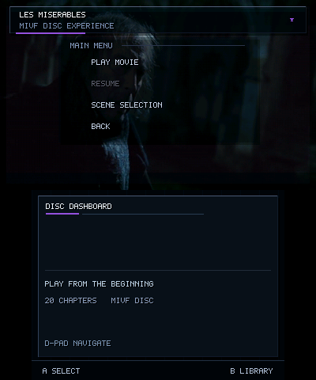
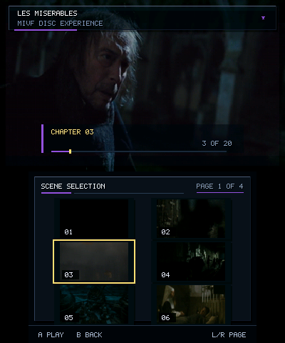
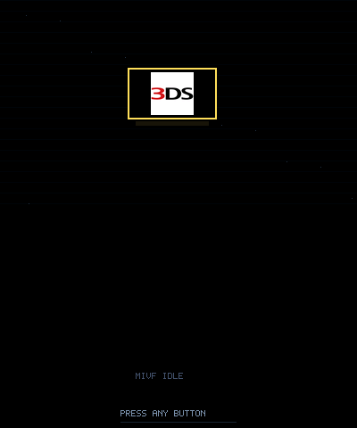

# MIVF — Media/Video Format & Player for Nintendo 3DS

MIVF is an experimental media format and Nintendo 3DS player designed for deterministic,
seekable, full-length video playback, with a dual-screen Library interface and a
DVD-style per-movie menu experience layered on top.


**Status:** The generation-safe NDSP audio clock and exact rational-FPS timing (decode,
seeking, MoFlex support) were **hardware-verified** on physical New/Old 3DS as of the
last tagged release, and remain unchanged since. Active development on top of that
release adds a dual-screen **Library** interface and a **DVD-style per-movie menu**
(Play/Resume/Scene Selection); this newer work is **build-verified and has now been
observed running correctly in the Azahar emulator** (Library, DVD root menu, and Scene
Selection), but has **not yet had a physical-hardware regression pass** — emulator
confirmation is not the same as hardware confirmation. See
[Verification & Compatibility Status](#verification--compatibility-status) below and the
full breakdown in [docs/validation-status.md](docs/validation-status.md) before relying
on anything past the core playback foundation.

## Index

- [Screenshots](#screenshots)
- [Major Features](#major-features)
- [Why MIVF Exists](#why-mivf-exists)
- [Player Experience](#player-experience)
- [DVD-Style Menu Experience](#dvd-style-menu-experience)
- [Encoding Overview](#encoding-overview)
- [Benchmarks](#benchmarks)
- [Quick Start](#quick-start)
- [Example Commands](#example-commands)
- [Sidecar & Asset Overview](#sidecar--asset-overview)
- [Exact Timing & Audio Notes](#exact-timing--audio-notes)
- [Build Instructions](#build-instructions)
- [Controls Summary](#controls-summary)
- [Documentation Index](#documentation-index)
- [Verification & Compatibility Status](#verification--compatibility-status)
- [Known Limitations](#known-limitations)
- [Roadmap](#roadmap)
- [Project Structure](#project-structure)
- [License, Credits & Contributing](#license-credits--contributing)

## Screenshots
<!-- MIVF_PHASE8_SCREENSHOT_DOCS_V1 -->
The current Library and DVD-menu captures below were produced in Azahar with a one-off
Phase 8.1 automatic showcase build. They confirm these rendered states in the emulator;
they do **not** constitute a physical-hardware regression test. Azahar display scaling
also does not represent the appearance of the original 3DS screens exactly.

### Dual-screen Library


The selected title uses the generic `MIVF MEDIA` fallback card in this capture. This
image demonstrates the Library layout and metadata path, but does not demonstrate
`.preview.cover` sidecar loading.

### DVD-style root menu



### Scene Selection



### Custom screensaver



The screensaver image confirms custom `.screensaver.cover` loading and one rendered
screensaver state through the showcase path. It does not by itself verify normal idle
timeout activation, continuous bouncing, collision behavior, or dismissal by every input.

### Earlier playback captures

These captures predate the Phase 8.1 Library/DVD-menu work, but remain useful for the
otherwise unchanged playback and Settings presentation.

**Playback with subtitles**


**Settings menu**


## Major Features

**Viewer-facing**

- Dual-screen Library: bottom-screen list, top-screen artwork/metadata preview
- Favorites and Recents, with numeric-aware natural filename sorting
- Resume bookmarks, shown as both a status badge and a pixel progress bar
- Auto-advance to the next file in a folder
- DVD-style per-movie menu: Play / Resume / Scene Selection / Back, with animated
  background, fades, and session-scoped cursor memory
- Scene Selection: a chapter-thumbnail grid generated at encode time, not decoded live
- Idle screensaver on the menu's root view, with an optional custom image
- Subtitles (`.srt`, multiple tracks, adjustable delay and on-screen position)
- Aspect ratio modes, playback speed 0.5×–2.0×, A/B scene looper
- Settings menu (brightness, themes, font scale, sleep timer, persisted volume, and more)
  and an in-app controls/help screen
- MoFlex (`.moflex`, MobiClip 3D video) playback compatibility

**Format & encoder**

- Exact rational frame rates (e.g. `24000/1001`), computed with exact fraction math —
  not a floating-point approximation
- M2Y1 (block-mode video codec) and M2Y2 (lossless range-coded re-encode, ~20–30%
  smaller)
- IA4M (ADPCM) and PC16 (PCM) audio, with sample-accurate packet sizing at exact
  rational rates
- Seek index, written both as a `.idx` sidecar and embedded in the `.mivf` file
- Resumable encoder jobs, per-stage timing reports, and a job/chunk-size benchmark
  workflow for tuning encode throughput
- Multiple motion-search algorithms for tuning encode speed vs. output size/quality

See [docs/CONTROLS.md](docs/CONTROLS.md) for how to use each feature, or
[docs/ARCHITECTURE.md](docs/ARCHITECTURE.md) for how the format/pipeline works under the
hood.

## Why MIVF Exists

The 3DS's built-in video format is MobiClip's proprietary MoFlex — playable, but closed,
and MIVF only ever implemented a *decoder* for it (see
[docs/MOFLEX_STATUS.md](docs/MOFLEX_STATUS.md)). MIVF exists as a fully open alternative
this project can both encode and decode: a page-based container, two from-scratch video
codecs (M2Y1/M2Y2), exact rational-rate timing so audio and video don't drift over a
feature-length runtime, and a player built to make watching something feel like using a
real disc menu, not just replaying a raw file. See
[Benchmarks](docs/PERFORMANCE_TUNING.md) for how MIVF's size/quality tradeoff compares to
MoFlex on real content.

## Player Experience

The Library is a dual-screen file browser: the bottom screen shows a scrollable list
(seven rows visible at once) with Favorite/Resume/Recent badges and a MIVF/MoFlex format
label; the top screen shows a debounced preview (artwork, synopsis, resolution/frame
rate) for whichever entry is highlighted. Selecting a file either starts playback
directly or opens that movie's DVD-style menu, depending on whether it has one (see
below). A title with a saved bookmark gets a `RESUME` status label in the list, and — for
the currently selected entry — the top-screen preview shows a pixel progress bar for its
saved position. Bookmarks are session-independent — they're read from a per-video
bookmark file, not kept only in memory.

Sorting is numeric-aware: `episode_9` correctly sorts before `episode_10` instead of
after it. Favorites and Recents promote entries to the top of the list with a badge
rather than a separate labeled section.

Full controls: [docs/CONTROLS.md](docs/CONTROLS.md). Full feature breakdown, including
what's build-verified vs. still unconfirmed on hardware:
[docs/player-ui.md](docs/player-ui.md).

## DVD-Style Menu Experience

Movies with a `.menu.ini` sidecar open into a DVD-style menu instead of playing
immediately. The **top screen** shows the authored artwork with an animated (Ken
Burns-style, integer/fixed-point) background and the root-menu buttons (Play/Resume/
Scene Selection/Back) laid directly over it; the **bottom screen** shows a contextual
"Disc Dashboard" panel in the root view, or the Scene Selection thumbnail grid when
browsing chapters. Sound effects play on move/select/back, with fade transitions
between states. The menu remembers which button and which Scene Selection page you last
had highlighted for that movie, for the current app session only.

Scene Selection shows chapter thumbnails in a 2-column × 3-row grid (6 per page),
generated once at encode/authoring time from the original source video — the player
never decodes the compressed `.mivf` just to draw a thumbnail. If a movie's menu
launches playback, ending or exiting playback returns to that same menu (not the flat
file browser); an idle timer on the menu's root view (not Scene Selection) triggers an
optional screensaver, dismissed by any key.

Only four menu actions exist: `play`, `resume`, `chapters`, `back` — anything else in a
`.menu.ini` is silently disabled rather than crashing. See
[docs/menu-authoring.md](docs/menu-authoring.md) for how to build one, and
[docs/player-ui.md](docs/player-ui.md) for the full feature-by-feature status.

## Encoding Overview

`encode_mivf.py` drives ffmpeg plus a native C encoder to turn an input video into
`.mivf`:

- **Video:** M2Y1 (default) or M2Y2 (`--m2y2`, lossless, smaller). Quality/size is tuned
  with `--qp`, `--keep`, `--lambda`, `--mv-range`, and `--motion-search`.
- **Audio:** IA4M (ADPCM, default) or PC16 (PCM, `--audio-codec pc16`).
- **Frame rate:** integer (`--fps 24`) or exact rational (`--fps 24000/1001`), parsed
  with exact fraction arithmetic so the container's rate fields are never a rounded
  approximation.
- **Seek index:** a `.idx` sidecar and an embedded footer are both written by default.
- **Resumable jobs (E0):** `--job-dir` keeps a persistent job directory with a validated,
  reusable video-only intermediate, so a failed or interrupted encode doesn't have to
  restart from zero.
- **Stage timing (E1):** `--timing-json` writes a per-stage breakdown (video encode,
  audio mux, M2Y2 pass, seek index, total) as JSON and CSV.

See [docs/encoding.md](docs/encoding.md) for the full guide,
[docs/cli-reference.md](docs/cli-reference.md) for every flag, and
[docs/encoder-recovery-and-profiling.md](docs/encoder-recovery-and-profiling.md) for the
E0/E1 job-recovery and profiling workflow.

## Benchmarks


On one 1-minute test source, `hierarchical --mv-range 12` reached within about half a
percent of exhaustive `full --mv-range 12` search's file size and PSNR, with roughly
half the median encode time. All three repeats per case were byte-identical; the
hierarchical case's three timing runs also included one notably slower outlier, so
treat the speedup as "usually true, not guaranteed" rather than a fixed multiplier. One
clip, one machine — see [PERFORMANCE_TUNING.md](docs/PERFORMANCE_TUNING.md#motion-search-modes)
for the full table.


M2Y2 is a lossless range-coded re-encode of the already-encoded M2Y1 video payload —
lossless relative to M2Y1's own decoded output, not relative to the original source
(M2Y1 itself is already a lossy encode of the source). In this matrix, converting a
high-quality warm-start encode to M2Y2 preserved its measured ~43.34 dB approximate
combined PSNR exactly while cutting final size from ~8.02 MiB to ~5.59 MiB.

Full methodology, more charts, and the audited source data behind these numbers:
[docs/benchmark-data/mivf_benchmark_data_audit.md](docs/benchmark-data/mivf_benchmark_data_audit.md).

## Quick Start

**Play videos:**

1. Download `mivf_player_3ds.cia` (HOME menu) or `mivf_player_3ds.3dsx` (Homebrew
   Launcher) from the [Releases page](https://github.com/Oldhimaster1/MIVF/releases).
2. Install `.cia` with FBI, or place `.3dsx` in `sdmc:/3ds/`.
3. Put `.mivf` files in `sdmc:/mivf/`. The player also scans
   `sdmc:/3ds/mivf_player_3ds/` and the SD root.

Full details: [docs/INSTALLING.md](docs/INSTALLING.md).

**Encode a video:**

```bash
python encode_mivf.py input.mkv output.mivf --m2y2
```

Requires Python 3 and `ffmpeg` on `PATH`. Full guide: [docs/encoding.md](docs/encoding.md).

## Example Commands

Every command below was checked against the current `python encode_mivf.py --help`
output before being included here.

```bash
# Safe, balanced encode (M2Y2, default quality settings)
python encode_mivf.py input.mkv output.mivf --m2y2

# Old-3DS-friendly: smaller, more evenly-sized video packets
python encode_mivf.py input.mkv output.mivf --m2y2 --profile 3ds-fast

# Exact rational rate + IA4M audio at a matching sample rate (no rounding)
python encode_mivf.py input.mkv output.mivf --m2y2 \
    --fps 24000/1001 --audio-rate 48000 --audio-codec ia4m

# Fastest test encode (small mv-range, no M2Y2 pass)
python encode_mivf.py input.mkv output.mivf --mv-range 4 --keep 4

# Persistent job directory, so a failed encode can be resumed
python encode_mivf.py input.mkv output.mivf --m2y2 --job-dir ./job_output

# Resume a previously interrupted job (same input + same settings required)
python encode_mivf.py input.mkv output.mivf --m2y2 --job-dir ./job_output --resume-job

# Finalize an already-encoded video-only .mivf (skip re-encoding the video)
python encode_mivf.py input.mkv output.mivf --finalize-from-video ./job_output/video_only.mivf

# Request an E1 stage-timing report (JSON + CSV written alongside)
python encode_mivf.py input.mkv output.mivf --m2y2 --timing-json ./timings/output.json

# Batch encode a whole folder
python encode_mivf.py ./videos/ ./output/ --m2y2
```

**Building the player:**

```bash
make          # builds mivf_player_3ds.3dsx (requires devkitPro / devkitARM + libctru)
make cia      # builds mivf_player_3ds.cia (also requires makerom + bannertool)
```

**Authoring menu/Scene-Selection assets** (see
[docs/menu-authoring.md](docs/menu-authoring.md) for the full walkthrough):

```bash
# Chapter thumbnails for Scene Selection, from the original source + a .chapters sidecar
python tools/mivf_build_chapter_thumbs.py input.mkv output.chapters output.chapthumbs

# A screensaver image sized/converted for the player's idle screensaver
python tools/mivf_make_screensaver_cover.py cover_art.png output.screensaver.cover
```

## Sidecar & Asset Overview

Place these next to `output.mivf`:

| File | Purpose |
| :--- | :--- |
| `output.srt`, `output.1.srt`, … | Subtitle tracks |
| `output.chapters` | Chapter markers with optional labels |
| `output.chapthumbs` | Scene Selection thumbnails (menu-authoring only) |
| `output.cover` | Browser poster (88×50 raw RGB565) |
| `output.preview.cover` | Larger browser preview (176×100 raw RGB565) |
| `output.nfo` | Synopsis text shown in the browser preview |
| `output.idx` | Seek index sidecar (auto-generated by the encoder) |
| `output.menu.ini` | DVD-style menu definition |
| `output.menu_bg.cover` | DVD-menu animated background (400×240 raw RGB565) |
| `output.screensaver.cover` | Idle-screensaver image (96×54 raw RGB565, exactly 10,368 bytes) |

Some of these (currently only `menu_bg.cover`) can alternatively be embedded directly
into the `.mivf` file as a MIVF Asset Bundle instead of shipped as separate sidecars. See
[docs/FILES_AND_SIDECARS.md](docs/FILES_AND_SIDECARS.md) for exact formats, sidecar-vs-
embedded precedence, and fallback behavior.

## Exact Timing & Audio Notes

MIVF's audio muxer requires an **exact integer number of audio samples per video
frame** — it does not support fractional or rounded packet sizes. This works out cleanly
for common combinations:

| Frame rate | Audio rate | Samples/frame | Notes |
| :--- | :--- | :--- | :--- |
| `24000/1001` (~23.976 fps) | 48000 Hz | 2002 | Exact; validated production rate |
| `24/1` | 48000 Hz | 2000 | Exact |
| `30/1` | 48000 Hz | 1600 | Exact |
| `24000/1001` | 44100 Hz | — | **Not supported** — does not divide evenly; the encoder raises an error rather than silently rounding |

Frame rates are parsed with Python's exact `Fraction` type, never a float approximation,
and validated to fit the container's rate fields before encoding starts. If you're
targeting a specific rational rate, pick an audio rate that divides evenly into it (48000
Hz covers the common film rates above) — the encoder will refuse to proceed otherwise
rather than produce audio that slowly drifts out of sync. This is one measured example,
not a claim that every rate/audio-rate pair has been tried — see
[docs/encoding.md](docs/encoding.md) for the full explanation.

## Build Instructions

Full instructions: [docs/DEVELOPING.md](docs/DEVELOPING.md).

```bash
# Requires devkitPro (3ds-dev group: devkitARM + libctru)
make          # builds mivf_player_3ds.3dsx
make cia      # builds mivf_player_3ds.cia (requires makerom + bannertool)
```

## Controls Summary

Full reference: [docs/CONTROLS.md](docs/CONTROLS.md), or open the **in-app help screen**
(press X in the Library, or Settings → CONTROLS during playback). **B's meaning changes by
context** — it is not a single universal "back" button:

| Context | B does |
| :--- | :--- |
| Library | Exit the app (same as START) |
| DVD menu root | Leave the menu, back to the Library |
| DVD menu Scene Selection | Back to the DVD menu root (not out of the menu) |
| During playback | Cycle the A/B scene-loop marker |
| Resume/Start-Over modal | Start over (same as START — neither means "cancel" here) |
| Settings overlay | Close and save |
| Help overlay | Close |

## Documentation Index

- [Installing](docs/INSTALLING.md)
- [Encoding Videos](docs/encoding.md)
- [CLI Reference](docs/cli-reference.md)
- [Encoder Internals](docs/encoder-internals.md)
- [Encoder Recovery & Profiling (E0/E1/E2)](docs/encoder-recovery-and-profiling.md)
- [Controls Reference](docs/CONTROLS.md)
- [Player UI (Library & DVD Menu)](docs/player-ui.md)
- [Menu & Scene Selection Authoring](docs/menu-authoring.md)
- [Files & Sidecars](docs/FILES_AND_SIDECARS.md)
- [Seek Index](docs/SEEK_INDEX.md)
- [MoFlex Status](docs/MOFLEX_STATUS.md)
- [Performance Tuning](docs/PERFORMANCE_TUNING.md)
- [Validation Status](docs/validation-status.md)
- [Developer Build](docs/DEVELOPING.md)
- [Troubleshooting](docs/troubleshooting.md)
- [Architecture](docs/ARCHITECTURE.md)
- [Release Checklist](docs/RELEASE_CHECKLIST.md)
- [Changelog](docs/changelog.md)

## Verification & Compatibility Status

Full breakdown and status vocabulary: [docs/validation-status.md](docs/validation-status.md).
Short version:

- **Hardware-verified:** core playback (NDSP audio clock, decode, seek, rational-FPS
  timing), MoFlex playback — unchanged by current work.
- **Build-verified, Emulator-tested (Azahar), hardware-unverified:** the dual-screen
  Library browser, the DVD-style root menu, and Scene Selection — all confirmed
  running correctly in Azahar, none yet confirmed on physical hardware.
- **Build-verified, partially emulator-tested (Azahar), hardware-unverified:** custom
  screensaver artwork loading and one rendered screensaver state. Normal idle activation,
  continuous motion/collision behavior, and input dismissal remain unverified.
- **Build-verified, hardware-unverified (not yet emulator-confirmed):** the menu-return
  fix, the Ken Burns easing pass's actual pan/zoom motion, the persisted volume setting,
  and the subtitle multi-line fix — all currently uncommitted.
- **Experimental (encoder):** `diamond`/`fast`/`hybrid`/`hierarchical` motion-search
  modes, `--warm-start-chunks`.

## Known Limitations

- The Library, DVD-style root menu, and Scene Selection have been confirmed running
  correctly in the Azahar emulator, but **none of the current Library/DVD-menu work has
  had a physical-hardware regression pass yet** — emulator confirmation is not hardware
  confirmation. Treat everything past the frozen playback foundation as "runs correctly
  in an emulator," not "hardware-confirmed."
- The MIVF-vs-MoFlex badge in the Library is a plain text label, not an icon/color
  system, and is silently overridden by the Favorite/Resume/Recent badges when more than
  one applies.
- Computed file size (`file_size_kb`) in the browser preview metadata is never actually
  rendered anywhere in the UI — it's calculated but currently invisible to the user.
- Only `menu_bg.cover` can be embedded in a `.mivf` as a MIVF Asset Bundle; chapter
  thumbnails and the screensaver image are sidecar-only.
- The DVD-style menu only recognizes four actions (`play`/`resume`/`chapters`/`back`) —
  there is no Setup, Movie Info, or Bonus Features page yet.
- E0's resume/refuse-on-mismatch logic is implemented and code-reviewed but has not been
  exercised end-to-end this cycle (i.e., deliberately killing and resuming a job).
- `diamond`/`fast`/`hybrid`/`hierarchical` motion-search modes and `--warm-start-chunks`
  are validated on a small number of local test clips on one machine — not a guarantee
  for every source.
- The repository's one automated test that calls a `read_mivf_first_page_offset`
  function currently fails, because that function doesn't exist in `encode_mivf.py` —
  a known, pre-existing gap in the test suite, not something newly introduced here.
- `pytest` is not installed by default in this environment; `python -m unittest
  discover -s tests` is the fallback that actually runs today.

## Roadmap

- Hardware-validate the Library/DVD-menu work above (now emulator-confirmed), then
  commit it.
- Continue encoder throughput work (motion search, chunking) without compromising
  determinism, rational-timing accuracy, or M2Y2 losslessness.
- **Phase 9 (planned, not implemented):** a redesigned bottom-screen playback dashboard —
  unobstructed top video area except for temporary overlays; cached/dirty-rendered
  panels for title, state, chapter, a rational-aware timeline with chapter/A-B markers,
  transport, volume, subtitles, speed, aspect, codec status, battery, and clock; a
  timeline that updates at roughly 5–10 Hz and a clock at 1 Hz, with immediate input
  feedback and animations only on real events. This explicitly does **not** touch NDSP,
  the audio clock, rational-FPS timing, decoding, seeking, or scheduling — those stay
  frozen.
- Expand Settings, Help, toasts, and subtitle handling.
- Add Setup / Movie Info / Bonus Features menu pages to the DVD-style menu.
- Expand which sidecar assets can be embedded via MASB (chapter thumbnails, screensaver
  image currently cannot be).
- Complete hardware regression testing and release packaging for everything currently
  build-verified only.

## Project Structure

- **`source/`** — Native 3DS player (C). `main.c` is the app; `mivf_*.c/.h` are modules.
- **`tools/`** — Native encoder, M2Y2 transcoder, seek-index/asset-authoring scripts, and
  helper binaries.
- **`meta/`** — Icon, banner, banner audio, makerom RSF.
- **`Makefile`** — Builds `.3dsx` and `make cia` for an installable title.
- **`encode_mivf.py`** — Python front-end for ffmpeg → `.mivf` encoding.
- **`docs/`** — Full documentation set (index above).

## License, Credits & Contributing

MIVF Player is released under the **MIT License**. See [LICENSE](LICENSE) for the full
terms.

**Attribution is required.** If you copy, modify, redistribute, or include substantial
portions of this project's source code, documentation, assets, or derived materials in
another project, you must preserve the copyright notice and license text, and provide
reasonable credit to Micah Lagger / MIVF Player for Nintendo 3DS.

See [NOTICE.md](NOTICE.md) for detailed attribution requirements, [CREDITS.md](CREDITS.md)
for project and third-party credits, and [CONTRIBUTING.md](CONTRIBUTING.md) to contribute.

Built with devkitPro / devkitARM and libctru. CIA packaging uses makerom and bannertool.
MoFlex demuxer and decoder are adapted from FFmpeg (LGPL); bundled FFmpeg-derived
components under `source/moflex/ffmpeg_support/` retain their original LGPL licensing.
