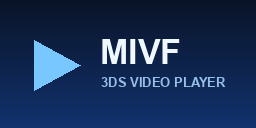

# MIVF Player for Nintendo 3DS



A homebrew video player for the Nintendo 3DS. MIVF is a custom, page‑based video
container with its own software codecs, a native C player that runs on the
console, and a Python encoder that turns ordinary `.mp4` files into `.mivf`.

It is built for the real hardware: the codecs are tuned for the ARM11, the
player streams pages from the SD card with a background reader, and the whole UI
(file browser, transport, settings) is drawn straight into the RGB565
framebuffers.

> Status: works on real hardware and on the [Azahar](https://azahar-emu.org/)
> emulator. Tested primarily at 400×240, 30 fps.

---

## Features

- **Custom codecs** — `M2Y1` (raw token YUV420) and `M2Y2` (the same picture,
  entropy‑coded with a division‑free binary range coder, ~24% smaller and still
  a locked 30 fps on hardware). Also reads `RAWV`, `M2Y0`, and `PC16`/`IA4M`
  audio.
- **File browser** with thumbnails, posters, synopsis, and favorites.
- **Auto‑resume bookmarks** — pick up exactly where you left off.
- **Playlists / auto‑advance** — automatically play the next file in the folder.
- **Aspect‑ratio modes** — FIT (letterbox), STRETCH (fill), NATIVE (1:1).
- **A/B scene looper** — mark two points and loop the section.
- **Playback speed** — 0.5× to 2.0×, audio stays in sync.
- **Sleep timer** + **clamshell pause/park** — closes cleanly and resumes on wake.
- **Subtitles** (`.srt`, multiple tracks), **chapters**, **themes**, adjustable
  **brightness**, **font scale**, and a persistent **settings menu**.
- **Touch transport** — drag the timeline to scrub.

---

## Controls

### File browser
| Button | Action |
| --- | --- |
| D‑Pad ↑/↓ | Move selection |
| A | Play |
| Y | Toggle favorite |
| B / START | Exit |

### Playback
| Button | Action |
| --- | --- |
| A | Play / pause |
| ←/→ | Seek −/+ (~5 s) |
| Touch + drag | Scrub timeline |
| **X** | **Cycle playback speed (0.5×–2.0×)** |
| **B** | **A/B loop: set A → set B → clear** |
| Y | Cycle subtitle track |
| L + D‑Pad | Audio (volume / stereo) |
| R + ↑/↓ | Screen brightness |
| R + ←/→ | Previous / next chapter |
| SELECT | Open settings |
| START | Stop and return to the browser |

### Settings menu (SELECT)
D‑Pad ↑/↓ to move, **A / ← / →** to change, **B** or **SELECT** to close and save.
Items include: Resume bookmarks, Auto dim, Dim timeout/brightness, Force stereo,
Debug overlay, Subtitle tracks, Chapters, Favorites, Theme skin, Font scale,
Sleep on lid close, Screen brightness, **Aspect ratio**, **Playback speed**,
**Auto‑advance**, and **Sleep timer**.

Settings persist to `sdmc:/mivf_settings.ini`. Bookmarks and favorites live next
to it on the SD card.

---

## Installing

1. Copy `mivf_player_3ds.3dsx` to `sdmc:/3ds/` and launch it from the Homebrew
   Launcher, **or** install the `.cia` (see below) to get a HOME‑menu icon.
2. Put your `.mivf` files in `sdmc:/mivf/` (the player also scans
   `sdmc:/3ds/mivf_player_3ds/` and the SD root).

### Optional sidecar files
Place these next to `yourvideo.mivf`:

| File | Purpose |
| --- | --- |
| `yourvideo.srt`, `yourvideo.1.srt`, … | Subtitle tracks (cycle with Y) |
| `yourvideo.chapters` | Chapter marks: `SECONDS Label`, `H:MM:SS Label`, or `SECONDS|Label` |
| `yourvideo.cover` | Poster (raw RGB565, browser‑preview sized) |
| `yourvideo.nfo` | Synopsis text shown in the browser |

---

## Building the player (.3dsx)

You need [devkitPro](https://devkitpro.org/wiki/Getting_Started) with the
**3ds-dev** group (devkitARM + libctru).

```sh
# Make sure DEVKITPRO / DEVKITARM are set and the toolchain is on PATH, then:
make
```

This produces `mivf_player_3ds.3dsx` with the embedded SMDH icon/metadata
(`meta/icon48.png`, title, author). To skip the icon, run `make NO_SMDH=1`.

## Building an installable .cia

The `.cia` needs two third‑party tools that are **not** part of devkitPro:

- **makerom** — <https://github.com/3DSGuy/Project_CTR/releases>
- **bannertool** — <https://github.com/Steveice10/bannertool/releases>

Drop both executables into `devkitPro/tools/bin` (or anywhere on `PATH`), then:

```sh
make cia
```

This builds the banner from `meta/banner.png` + `meta/banner.wav`, reuses the
SMDH icon, and packages everything per `meta/app.rsf` into
`mivf_player_3ds.cia`. Edit the title/author in the `Makefile` (`APP_TITLE`,
`APP_AUTHOR`) and the IDs in `meta/app.rsf` for your own release. Regenerate the
icon/banner artwork any time with `python meta/make_assets.py` (needs Pillow).

---

## Encoding videos to .mivf

`encode_mivf.py` wraps `ffmpeg` and the native encoder to turn an `.mp4` (or a
folder of them) into `.mivf`:

```sh
# Single file, M2Y1:
python encode_mivf.py input.mp4 output.mivf

# Smaller, entropy-coded M2Y2 (recommended):
python encode_mivf.py input.mp4 output.mivf --m2y2
```

`ffmpeg` must be available (bundled, next to the script, or on `PATH`). The
`--m2y2` path encodes to `M2Y1` first, then losslessly transcodes to `M2Y2`.

---

## Repository layout

```
source/        Native 3DS player (C). main.c is the app; mivf_*.c/.h are modules.
               mivf_rc.h is the shared M2Y2 range coder (encoder + player).
tools/         Native encoder + M2Y2 transcoder/verifier and helpers.
meta/          Icon, banner, banner audio, makerom RSF, asset generator.
Makefile       Builds the .3dsx (and `make cia` for the installable title).
encode_mivf.py Python front-end for ffmpeg -> .mivf encoding.
```

---

## Acknowledgements

Built with [devkitPro / devkitARM](https://devkitpro.org/) and
[libctru](https://github.com/devkitPro/libctru). CIA packaging uses
[makerom](https://github.com/3DSGuy/Project_CTR) and
[bannertool](https://github.com/Steveice10/bannertool).

## License

Released under the [MIT License](LICENSE).
