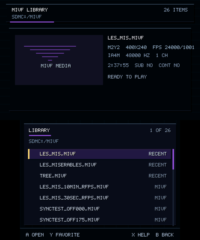

# Library

**Status:** Build-verified; the Library browser has been confirmed running correctly in
the Azahar emulator. Not yet part of a documented, model-specific physical-hardware
validation pass — see [Project Status](../status.md). Every feature below is individually
status-rated in more detail in [Validation Method](../compatibility/validation-method.md).

- **Layout:** bottom screen shows a scrollable list, seven rows visible at a time; top
  screen shows a preview (artwork, synopsis, resolution/frame rate) for the highlighted
  entry.
- **Preview loading:** debounced by ~200 ms so scrolling quickly doesn't trigger a preview
  load on every row you pass over.
- **Preview artwork resolution order:** (1) reuse the already-displayed 176×100 image if
  it already matches this file, (2) check the 4-slot in-RAM LRU cache by path, (3) load
  a `.preview.cover` sidecar (176×100) if present, (4) load a `.cover` sidecar (88×50) if
  present and build a softened 176×100 in-memory display copy from it (box-filter
  averaging of 2×2 pixel blocks, not nearest-neighbor duplication — this copy is
  session-only RAM, never written back as a `.preview.cover` file), (5) decode the file's
  first successfully-decoded video frame as a last resort, (6) a generic placeholder
  card if nothing above produced artwork. `.preview.cover` itself is meant to be a
  separately authored sidecar — the box-filter upscale only exists as a fallback for
  files that only have the legacy 88×50 `.cover`. See
  [Files & Sidecars](../authoring/files-and-sidecars.md#cover-poster-and-preview) for the
  exact order and formats.
- **In-RAM preview cache:** 4 slots, LRU eviction (least-recently-used, not
  first-in-first-out) — the cache tracks a tick counter and evicts the oldest-touched
  slot. Session-only; nothing here is written to the SD card.
- **Favorites / Recents:** both are lists of paths (Favorites capped at 128 entries,
  Recents capped at 16, most-recently-used order) that promote an entry to the top of
  the list and add a badge. There is **no separate "QUICK ACCESS" section label** —
  despite being a natural assumption, promoted entries stay in the same list, just
  reordered and badged.
- **Sorting:** numeric-aware natural sort — `episode_9` correctly sorts before
  `episode_10`, not after it, because digit runs are compared by length then value
  rather than character-by-character.
- **Format badge:** a plain text label, `"MIVF"` or `"MOFLEX"` — not an icon or color
  system. It's silently overridden by the FAVORITE, RESUME, or RECENT badge when more
  than one applies to the same entry (in that priority order). Treat this as a partial
  implementation of "distinguish MIVF from MoFlex at a glance," not a finished visual
  system.
- **Resume indicator:** a title with a saved bookmark gets a `RESUME` status label in
  the list itself; when it's the currently selected entry, the top-screen preview panel
  additionally shows a real pixel progress bar for its saved position — the progress bar
  lives in the preview, not under the list row. See [Resume](resume.md).
- **Synopsis:** loaded from `.nfo`, capped at 19+19 characters (two lines) — long
  synopses are truncated, not wrapped further.
- **Metadata footer:** mostly cosmetic string-reformatting (e.g. the summary line format
  changed from `"%s %ux%u @ %u/%u"` to `"%s  %uX%u  FPS %u/%u"`). One real, honest gap:
  file size is computed internally (`file_size_kb`) but is **never actually rendered
  anywhere in the UI** — a calculated value with no display path yet, not a finished
  feature.
- **Show-all-directories toggle, Settings, Help:** unchanged, no regressions found.

*Emulator capture (Azahar), used for interface inspection — not physical-hardware
performance evidence.* The capture above exercises the generic `MIVF MEDIA` fallback
card, not a separately authored `.preview.cover` sidecar; the validation status for
sidecar loading remains qualified accordingly.
