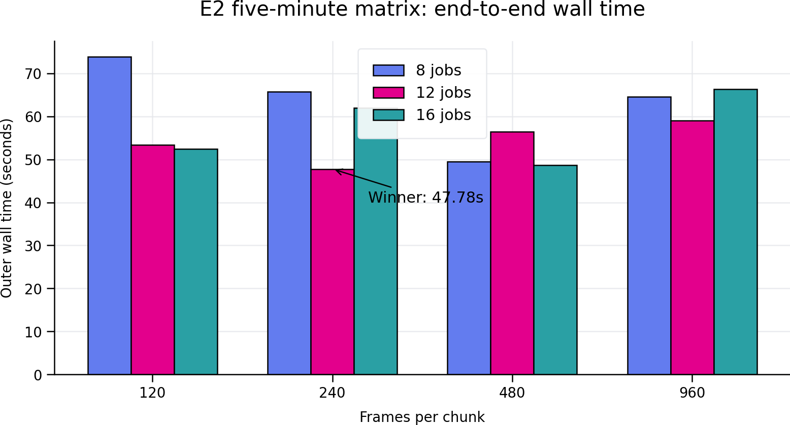
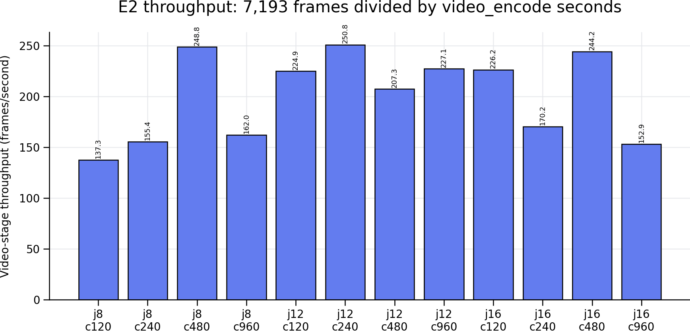
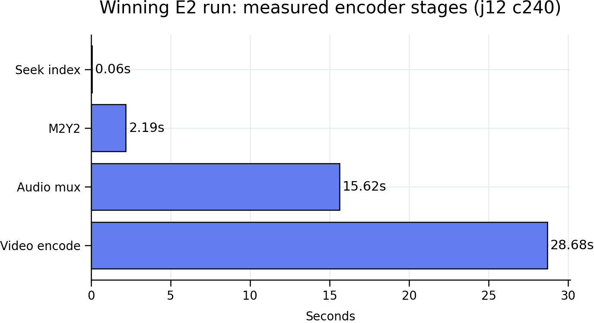

# Encoder Recovery & Profiling (E0 / E1 / E2)

This page covers three related encoder-side capabilities: resumable jobs (E0), per-stage
timing reports (E1), and the jobs/chunk-frames benchmark workflow (E2). All three are
verified against the current `encode_mivf.py` — run `python encode_mivf.py --help` to
confirm the exact flags on your checkout before relying on this page.

## E0 — Resumable Encoder Jobs

| Flag | Purpose |
| :--- | :--- |
| `--job-dir JOB_DIR` | Persistent E0 job directory (instead of a throwaway temp dir) |
| `--resume-job` | Reuse a validated video-only intermediate already in `--job-dir` |
| `--keep-intermediates` | Preserve E0 job/intermediate files instead of cleaning them up |
| `--finalize-from-video FINALIZE_FROM_VIDEO` | Skip the video encode and finalize this existing video-only `.mivf` |

```bash
# First attempt, with a persistent job directory
python encode_mivf.py input.mkv output.mivf --m2y2 --job-dir ./job_output

# If it was interrupted (crash, Ctrl-C, power loss), resume it:
python encode_mivf.py input.mkv output.mivf --m2y2 --job-dir ./job_output --resume-job

# Or, if the video-only intermediate already finished, skip straight to finalizing:
python encode_mivf.py input.mkv output.mivf --finalize-from-video ./job_output/video_only.mivf
```

**How resume validation works** (from `encode_mivf.py`'s `e0_settings_fingerprint` /
`e0_prepare_job`): every job directory holds a `job_manifest.json` (schema
`mivf-encode-job-v1`) containing a fingerprint of the input file (path, size, mtime,
SHA-256) and every quality-affecting setting — width, height, fps numerator/denominator,
audio rate/channels/codec/offset, keyint, qp, c-qp-offset, lambda, keep, mv-range,
motion-search mode, jobs, chunk-frames, warm-start-chunks, and max-video-packet-kb. On
`--resume-job`, the encoder recomputes this fingerprint from the current command line and
input file, and **refuses to resume** (`resume refused: input/settings fingerprint
differs from job manifest`) if anything in it differs from what's recorded — it will not
silently resume with different settings than the original run used. The manifest also
tracks a `stage` field and per-stage timings as the job progresses, updated atomically
(write-to-temp-then-rename) after each stage.

This mechanism is implemented and was verified by reading the source directly; it has
not been exercised end-to-end this documentation cycle (i.e., no encode was deliberately
killed mid-run and resumed to watch the refusal/resume paths fire live). See
[Validation Method](../compatibility/validation-method.md).

## E1 — Per-Stage Timing Reports

```bash
python encode_mivf.py input.mkv output.mivf --m2y2 --timing-json ./timings/output.json
```

Writes a JSON report at the given path, plus a CSV alongside it with the same data
(`output.timings.csv` next to `output.timings.json`). Schema `mivf-encoder-stage-timings-v1`:

```json
{
  "schema": "mivf-encoder-stage-timings-v1",
  "input": "...", "output": "...", "fps": "24000/1001",
  "jobs": 12, "chunk_frames": 240, "frames": 7193,
  "stages": [
    {"stage": "video_encode", "seconds": 28.68, "percent_total": 61.47},
    {"stage": "audio_mux",    "seconds": 15.62, "percent_total": 33.47},
    {"stage": "m2y2",         "seconds": 2.19,  "percent_total": 4.68},
    {"stage": "seek_index",   "seconds": 0.06,  "percent_total": 0.12},
    {"stage": "total",        "seconds": 46.66, "percent_total": 100.0}
  ],
  "encode_stats": { "elapsed_sec": 28.67, "frames": 7193, "helper_psnr": {"...": "..."}, "segment_timings": ["..."] }
}
```

There are exactly these 5 stages — no separate "ffmpeg decode" stage is tracked apart
from `video_encode`. The CSV mirrors the `stages` list with `stage,seconds,percent_total`
columns.

The human-readable console log prints the same breakdown as a `STAGE TIMING` block,
followed by an `ENCODE SUMMARY` block whose `encode wall time: X s (Y fps)` line is the
authoritative source for any "encode FPS" figure — this is the *video-encode-stage* FPS
(frames ÷ video_encode seconds), distinct from:

- **FFmpeg's own progress-line FPS** (its decode/pipe throughput, not the MIVF encode
  stage),
- **committed-segment FPS** (any one worker's chunk-level rate), and
- **full end-to-end wall time** (the `total` stage, which includes audio mux and M2Y2 —
  typically much slower than the video-encode stage alone, since audio muxing and M2Y2
  are not parallelized the same way).

**Always parse the final `stages`/`ENCODE SUMMARY` figures, not an early `frames=`
progress line** — see the E2 section below for a concrete case where trusting the wrong
number produced a badly wrong headline figure.

## E2 Jobs and Chunk-Frames Benchmarking

There's no dedicated benchmark-runner script for the jobs × chunk-frames matrix — it was
run ad hoc, once per combination, using `--job-dir` and `--timing-json`:

```bash
python encode_mivf.py sample.mkv j12_c240.mivf --jobs 12 --chunk-frames 240 \
    --job-dir ./job_j12_c240 --timing-json ./j12_c240.timings.json
```

A 5-minute sample was run across jobs {8, 12, 16} × chunk-frames {120, 240, 480, 960} —
12 combinations, each producing a `.mivf`, `.idx`, `.log`, `.timings.json`,
`.timings.csv`, and `job_manifest.json`.

### Corrected results

The preserved roll-up (`e2_5min_summary.md`) reports the winning case's "Video FPS" as
**8.37 fps — this is wrong.** Cross-referencing that same case's own
`j12_c240.timings.json` and `j12_c240.log` gives the real figure:

| Case | Total time | Video-encode-stage time | Correct video FPS | Final size |
| :--- | ---: | ---: | ---: | ---: |
| **12 jobs, 240 frames/chunk (winner)** | 47.78 s | 28.68 s | **~250.8 fps** (7193 frames ÷ 28.681782 s, from the `stages` list) | 17.67 MiB |

The wrong 8.37 figure appears to come from dividing frames by the *total* wall time (or
a similarly mis-scoped denominator) rather than the video-encode stage specifically —
exactly the "parse the authoritative stage record, not an early progress line" trap this
page warns about above. **Use ~250.8 fps, not 8.37 fps, if quoting this result.** (The
same JSON's `encode_stats.elapsed_sec` field, a very slightly different internal timer
reading than the `stages` entry, computes to ~250.9 fps — both are correct-ish and
differ by under a tenth of a second; pick one consistently rather than treating either
as more precise than it is.)

Other observations from the same 12-case sweep: 16 jobs did not automatically outperform
12 (worker overhead started to dominate); 120-frame chunks were worse across the board
(more segment starts, slightly larger output, lower throughput) than 240/480/960-frame
chunks. This is one 5-minute sample, one combination per case, run once on one
machine — a starting point for your own tuning, not a universal setting.







**Outer wall time, encoder-measured total, and video-encode-stage time are three
different numbers** — don't conflate them. Outer wall time (`47.78 s` for the winner)
is what a shell timer would show, including process startup; the encoder's own measured
total (`46.66 s`) is the sum of its five internal stages; the video-encode stage alone
(`28.68 s`) is what the ~250.8 fps figure above is computed from. All three are
legitimate, they just answer different questions.

Full methodology and the audited CSVs behind these three charts:
[Benchmark Methodology](benchmark-methodology.md).

**This E2 benchmark used fast/low-quality throughput-tuned settings** (`qp 45`, `keep 4`,
`mv-range 4`, `motion-search diamond`, `lambda 45` — combined PSNR ≈37.5 dB) to isolate
job/chunk scaling from quality effects. Don't read 37.5 dB as representative of MIVF's
general visual quality — MIVF's quality-focused defaults (`qp 34`, `keep 16`) and the
Les Misérables-style production settings (`qp 24`, `keep 16`) used in
[PERFORMANCE_TUNING.md](performance-tuning.md#motion-search-modes) land around 43 dB on
comparable content.

## Native Helper Binary Gotcha

`encode_mivf.py` loads its native encoder helper (`miv2y_moflex_tier`) from the
**repository root**, not from `tools/`. If you rebuild the helper and only update
`tools/miv2y_moflex_tier.exe`, the pipeline will keep silently running the stale
root-level copy — a genuinely confusing "the new code doesn't work" symptom that's
actually "the new code was never run." `tools/build_miv2y_helper.sh` exists specifically
to avoid this: it always builds to a temp file first, and only replaces **both**
`tools/miv2y_moflex_tier.exe` and the repo-root copy if the build succeeds, then verifies
the two installed copies are byte-identical.

```bash
bash tools/build_miv2y_helper.sh              # release build, installs to both locations
bash tools/build_miv2y_helper.sh --profile     # adds -pg for gprof profiling
```
