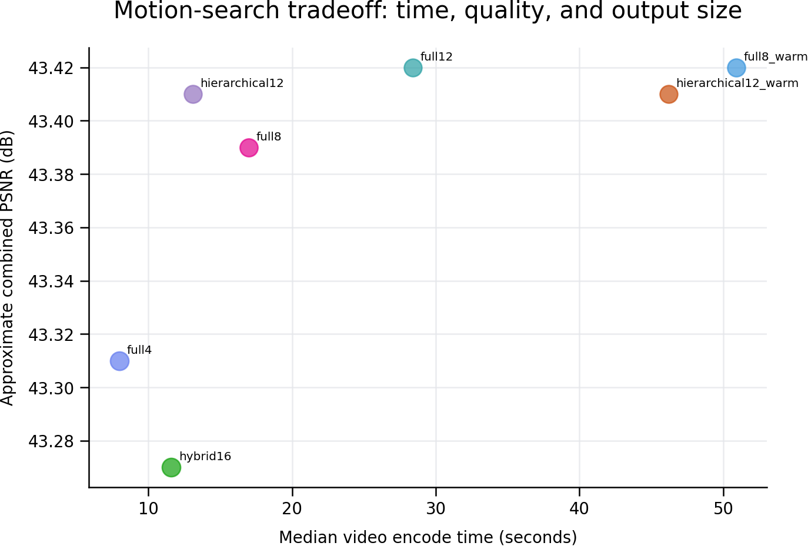
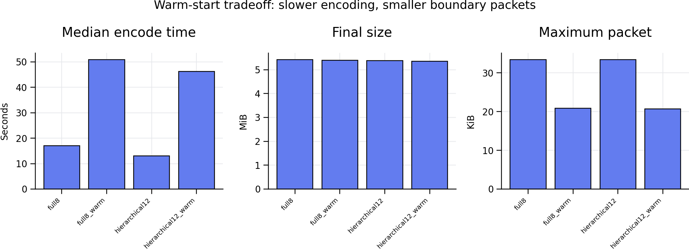

# Performance Tuning

MIVF decode performance depends on the encoded file's characteristics and the target 3DS
hardware. Encode-side performance (how long `encode_mivf.py` takes) is a separate
concern, covered in the second half of this page and in
[encoder-recovery-and-profiling.md](encoder-recovery-and-profiling.md).

## Hardware Differences (Playback)

| Hardware | CPU | Recommendation |
| :--- | :--- | :--- |
| New 3DS | 4× ARM11 @ 804 MHz | Default encoder settings work well for most content. |
| Old 3DS | 2× ARM11 @ 268 MHz | Use `--profile 3ds-fast` and consider lowering `--keep`. |

## Encoder Profile: 3ds-fast

The `--profile 3ds-fast` flag constrains per-video-packet sizes to prevent decode stalls
on the slower Old 3DS CPU.

```bash
python encode_mivf.py input.mkv output.mivf --m2y2 --profile 3ds-fast
```

This adjusts encoder parameters to produce smaller, more evenly-sized video packets at
the cost of some compression efficiency.

## Reducing Per-Packet Cost

If playback is still choppy on Old 3DS, try progressively more aggressive settings:

```bash
# Step 1: 3ds-fast profile
--profile 3ds-fast

# Step 2: Reduce transform coefficients
--keep 8

# Step 3: More aggressive
--keep 4 --qp 34

# Step 4: Lower frame rate
--fps 24
```

## Diagnosing with Packet Size Report

```bash
python encode_mivf.py input.mkv output.mivf --m2y2 --report-packet-sizes
```

**Guideline:** Keep most packets under 64 KB for Old 3DS. If you see many packets above
128 KB, apply more aggressive tuning.

## Content Factors

- **High motion** (action scenes, camera pans): produces larger packets. Consider
  `--profile 3ds-fast`.
- **Static scenes** (interviews, slideshows): encode efficiently, rarely need tuning.
- **High resolution:** 400×240 is the recommended maximum. Larger resolutions multiply
  decode cost.
- **Frame rate:** 30 fps at 400×240 is a common sweet spot; exact rational rates like
  `24000/1001` are also supported and don't cost anything extra at decode time — the
  container stores the rate directly, there's no runtime conversion. See
  [Encoding Overview](../authoring/overview.md#frame-rate) for the audio-rate compatibility rules that come
  with rational rates.

## Browser Performance

- Preview thumbnail loading is debounced — the preview only loads after the cursor has
  been still for ~200 ms, keeping list scrolling smooth.
- Settings are saved only on menu close, not on every value change, preventing SD-card
  write stalls during adjustment.
- The DVD-style menu caches full rendered frames and only redraws on an actual change
  (fade in progress, page/selection change, or the next Ken Burns animation step) rather
  than every loop iteration — see [Movie Menus](../player/movie-menus.md#cached-frame-rendering).

## MoFlex Performance

- New 3DS handles typical MoFlex content well.
- Old 3DS may struggle with 3D (frame-interleaved) MoFlex content.
- 2D MoFlex content is generally easier to decode.

---

## Encode-Side Performance

Benchmark data and methodology: [Benchmark Methodology](benchmark-methodology.md).

### File Size: MIVF vs MoFlex

File size efficiency versus the 3DS's built-in MoFlex (MobiClip) format was the original
motivation for this project. One 62-second source clip (`anime.mp4`, 400×240, 30 fps),
encoded once with a real 2-pass MobiClip encode, and four times through
`encode_mivf.py` at different quality settings. MIVF only ever implemented a MoFlex
*decoder* (for playback compatibility) — never an encoder — so the MoFlex file here was
produced with separate external tooling, not anything in this repo.

<picture>
  <source media="(prefers-color-scheme: dark)" srcset="../assets/benchmarks/chart_moflex_dark.svg">
  
</picture>

| Encode | Total file size | vs MoFlex | Video stream only | vs MoFlex video | PSNR (combined) | Encode time* |
| :--- | ---: | ---: | ---: | ---: | ---: | ---: |
| MoFlex (2-pass, ~1800 kbps) | 16.24 MiB | — | 13.08 MiB | — | not measured** | ~154 s |
| MIVF `--qp 24` (high quality) | 16.57 MiB | +2.0% | 15.11 MiB | +15.5% | 37.67 dB | 23–61 s |
| MIVF default | 16.12 MiB | −0.7% | 14.66 MiB | +12.1% | 37.87 dB | 23–61 s |
| MIVF `--profile 3ds-fast` | 11.68 MiB | −28.1% | 10.22 MiB | −21.9% | 35.26 dB | 23–61 s |
| MIVF smallest settings*** | 9.60 MiB | −40.9% | 8.14 MiB | −37.8% | 33.59 dB | 23–61 s |

\* Wall-clock, single dev machine, `--jobs 8`; varied 23–61 s run-to-run depending on
system load — treat as "same rough order of magnitude," not a controlled benchmark.
MoFlex's ~154 s used a separate 2-pass external tool on the same machine, so it isn't a
fair speed comparison either — included only for scale. \
\*\* MIVF has no MoFlex encoder, only a decoder, so there's no in-repo way to compute
reference PSNR for the MoFlex file — only its size is compared here. \
\*\*\* `--m2y2 --profile 3ds-fast --qp 45 --lambda 45 --keep 4 --c-qp-offset 10`

**Takeaway:** total file size is close between the formats — MIVF's default settings
land within a percent of MoFlex, and the high-quality preset is actually a couple percent
*larger*. MIVF only pulls meaningfully ahead once you're willing to spend quality to get
there: `--profile 3ds-fast` trades about 2.4 dB of PSNR for ~28% smaller files, and the
smallest-settings preset trades ~4 dB for ~41% smaller. This is a fully open format this
project can both encode and decode, with the quality/size tradeoff fully exposed and
tunable — not a claim that it beats MoFlex at equal quality on every source.

### Motion Search Modes

`--motion-search` trades encode time against output size/quality. `full` (the default)
is an exhaustive search and is the only mode with a long production track record.
`diamond`, `fast`, `hybrid`, and `hierarchical` are experimental.

The table below is the authoritative, hash-verified result of a controlled 1-minute
matrix (`tools/run_final_speed_matrix.py`) on a single Les Misérables test clip at
production-like quality settings (400×240, `24000/1001` fps, 48 kHz IA4M, `--keep 16
--qp 24`, M2Y2 on) — **one clip, one machine, 3 rounds per case.** Every case's output
hashed byte-identical across all 3 repeats (the run aborts if it doesn't), so the
numbers below reflect real determinism, not an average across different outputs.

| Case | Encode time (median) | Final size | vs `full12` size | PSNR (combined) |
| :--- | ---: | ---: | ---: | ---: |
| `full`, `--mv-range 4` | 8.0 s | 5.61 MiB | +4.7% | 43.31 dB |
| `full`, `--mv-range 8` | 17.0 s | 5.42 MiB | +1.3% | 43.39 dB |
| `full`, `--mv-range 12` | 28.4 s | 5.36 MiB | — | 43.42 dB |
| `hierarchical`, `--mv-range 12` | **13.1 s** | 5.38 MiB | +0.4% | 43.41 dB |
| `hybrid`, `--mv-range 16` | 11.6 s | 5.60 MiB | +4.5% | 43.27 dB |
| `full` `--mv-range 8` + `--warm-start-chunks` | 50.9 s | 5.40 MiB | +0.9% | 43.42 dB |
| `hierarchical` `--mv-range 12` + `--warm-start-chunks` | 46.2 s | 5.36 MiB | +0.1% | 43.41 dB |



PSNR above is the native helper's own frame-weighted approximate aggregate, not an
independent full-file decode comparison — treat it as directionally useful, not a
lab-grade quality metric.

**Takeaways, specific to this clip/machine:**

- `hierarchical --mv-range 12` matched `full --mv-range 12`'s file size within half a
  percent and its PSNR within 0.01 dB, with a **13.1 s median** encode time versus 28.4 s
  for `full --mv-range 12` — in under half the time. This is the standout result in this
  matrix, but it is a single clip on a single machine — not a universal guarantee. The
  median also hides real variance worth disclosing: the three `hierarchical` repeats
  measured 32.5 s, 12.3 s, and 13.1 s — one clear outlier alongside two consistent runs
  (all three still produced byte-identical output, so this is timing noise, likely
  machine load or cold-cache effects, not nondeterminism). Don't treat 13.1 s as a
  perfectly stable number; treat it as "usually fast, occasionally not" on this machine.
- `hybrid --mv-range 16` is the fastest non-`warm-start` option here but gives up more
  size (and slightly more PSNR) than `hierarchical` does for a similar time budget.
- **`--warm-start-chunks` made both cases 3–4× *slower* in this run**, despite shrinking
  output slightly (it avoids a hard keyframe reset at chunk boundaries). It serializes
  chunk encoding — each chunk needs its predecessor's finished reconstruction first, so
  chunk-level parallelism is lost. Don't reach for it as a size optimization without
  budgeting for that time cost; it did not "pay for itself" on this clip.
- `full --mv-range 4` is fastest overall but gives up the most size/quality of the
  non-`warm-start` cases.



`--warm-start-chunks` serializes chunk encoding by design (each chunk depends on its
predecessor's finished reconstruction), which is why it costs so much wall time despite
the packet-size win — it isn't a bug to be optimized away, it's the mechanism.

If you try `diamond`/`fast`/`hybrid`/`hierarchical` for a release, use
`--report-packet-sizes` and compare the `ENCODE SUMMARY` output (frame-weighted PSNR,
mode histogram, byte counts) against a `full` encode of the same source first — see
[Validation Method](../compatibility/validation-method.md) for exactly what has and hasn't been
verified about each mode.

### M2Y1 vs M2Y2 with Warm-Start (Quality Matrix)

A separate 1-minute matrix (`converted_les_mis_quality_matrix_1min/`, 1,441 frames,
~60.1 s, same production-like settings as above) isolates what M2Y2 buys you once
warm-start-chunks is already in the mix:

| Case | Codec | Final size | PSNR (combined) | Encode time |
| :--- | :--- | ---: | ---: | ---: |
| Baseline, `--keep 8 --qp 34` | M2Y1 | 5.46 MiB | 39.88 dB | 22.7 s |
| HQ, `--keep 16 --qp 24` | M2Y1 | 8.04 MiB | 43.31 dB | 16.9 s |
| HQ + `--warm-start-chunks` | M2Y1 | 8.02 MiB | 43.34 dB | 45.2 s |
| HQ + `--warm-start-chunks` + `--m2y2` | M2Y2 | 5.59 MiB | 43.34 dB | 62.6 s |

**Takeaway:** M2Y2 preserves the HQ+warm-start PSNR exactly (43.34 dB, identical to the
M2Y1 warm-start case — it's a lossless re-encode, so this is expected, not a
coincidence) while cutting file size from 8.02 MiB to 5.59 MiB, roughly 30% smaller, at
the cost of an additional range-coding pass on top of an already-slower warm-start
encode. This is the clearest evidence in this repository that M2Y2 buys real size
reduction with no quality tradeoff — the tradeoff is entirely in encode time, not output
quality. One clip, one machine.

### E2 Benchmarking Jobs and Chunk-Frames

`--jobs` and `--chunk-frames` control how the encode is split across parallel workers.
There's no dedicated benchmark-runner script for this — the matrix below was produced by
running `encode_mivf.py` once per combination with `--job-dir`/`--timing-json`, on a
5-minute sample, comparing jobs {8, 12, 16} × chunk-frames {120, 240, 480, 960}. Full
methodology, exact commands, and the corrected timing figures (the preserved summary
file's own FPS column was found to be wrong during a later documentation pass — don't
reuse it) are in
[encoder-recovery-and-profiling.md](encoder-recovery-and-profiling.md#e2-jobs-and-chunk-frames-benchmarking).
Winner on that one sample: **12 jobs, 240 frames/chunk** — ~28.7 s video-encode stage,
~250.8 fps, ~46.7 s total encoder time. Treat it as one machine, one sample, not a
universal setting.
